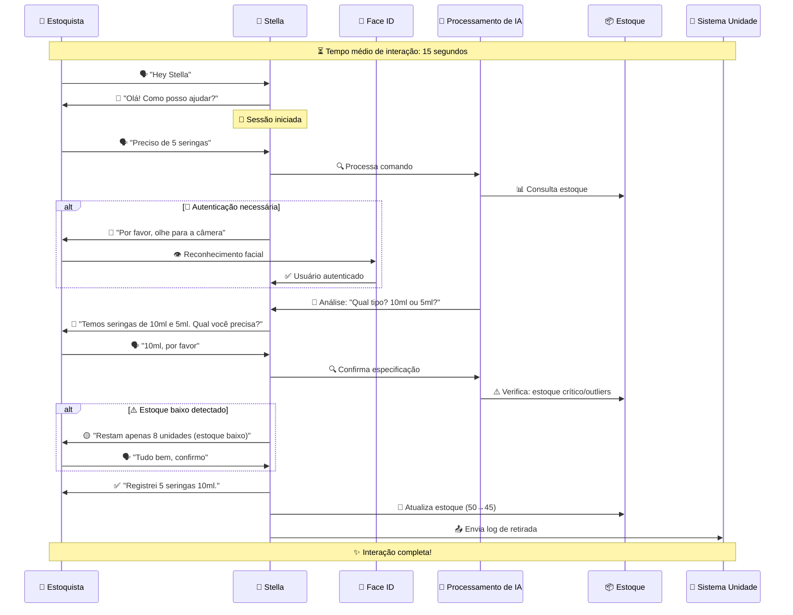
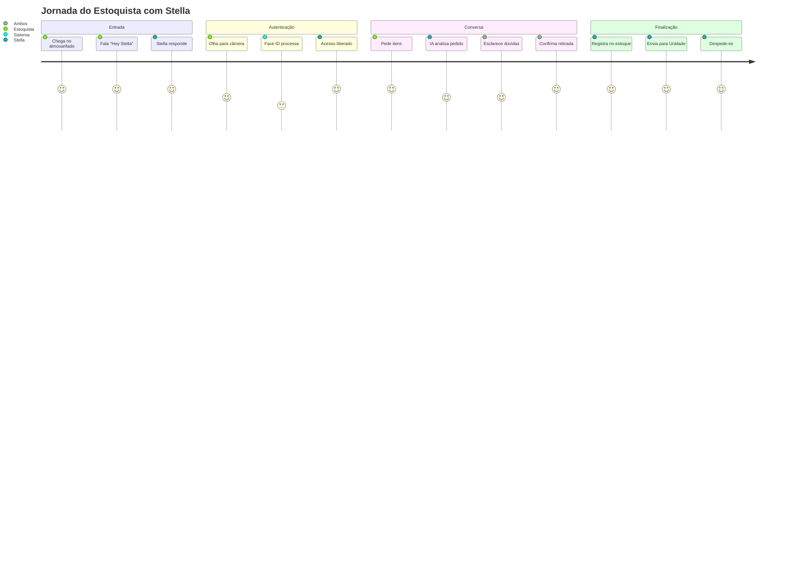
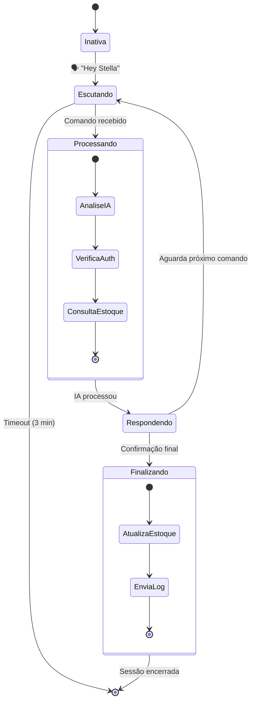

# 🤖 Stella Agent - DASA Challenge

Assistente Inteligente para Gerenciamento de Almoxarifado com reconhecimento facial, comandos de voz e integração com sistemas de unidade.

## 📋 Visão Geral

A Stella Agent é um agente de IA construído para resolver o problema de vazão de estoque e aviso tardio de estoque em baixa, evidênciado pela DASA. Consiste em um assistente de retirada de produtos do estoque, de forma resumida, a Stella (de forma natural), conversa com o funcionário para saber exatamente o que e quantas unidades ele está retirando. Após confirmação (Quando ambas as partes não tem mais dúvidas), a Stella registra essa retirada e envia para o Sistema de Unidade do hospital, o qual tem todos os logs de retirada e controle de estoque. A Stella foi construída para agilizar o trabalho do estoquista sem que ele delegue a função de controlar o Estoque.

## 🔄 Fluxo da Stella

### Diagrama de Interação



###  Jornada de uma retirada




### Fluxo de Estado da Stella



## ⚡ Tempos de Resposta

| Ação | Tempo Esperado | Método |
|------|----------------|--------|
| 🗣️ **Comando de voz** | ~50ms | HTTP Response |
| 🧠 **Processamento IA** | ~2-4s | WebSocket Event |
| 📸 **Reconhecimento facial** | ~1-2s | WebSocket Event |
| 📝 **Registro no estoque** | ~100ms | Background |
| 📤 **Envio para Unidade** | ~200ms | Background |
| ⏱️ **Total da interação** | **< 15s** | **Objetivo** |

## 🏗️ Estrutura do Projeto

```
stella/
├── api/               # Fluxo e padronização de API
│   ├── __init__.py
│   ├── models/
│   ├── routes/
│   └── service/
├── agent/             # Processamento de voz e comandos
│   ├── __init__.py
│   └── speech_processor.py
├── face_id/           # Reconhecimento facial
│   ├── __init__.py
│   └── face_recognizer.py
├── data/              # Simples database com Json
│   ├── faces.json
│   └── stock.json
├── messaging/         # Comunicação com Sistema da Unidade
│   ├── __init__.py
│   └── unit_system_client.py
├── websocket/         # Comunicação com Front da Stella
│   ├── __init__.py
│   └── websocket_manager.py
├── config/            # Configurações e armazenamento
│   ├── __init__.py
│   ├── settings.py
│   └── stella_config.yaml
main.py                # Inicializar aplicação
```

## 🚀 Setup e Instalação
Visite o arquivo INSTALLATION_GUIDE.md

Este projeto é parte do DASA Challenge - FIAP 2025.