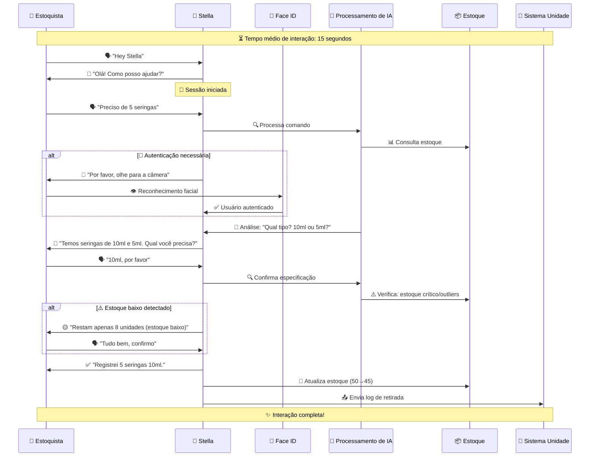
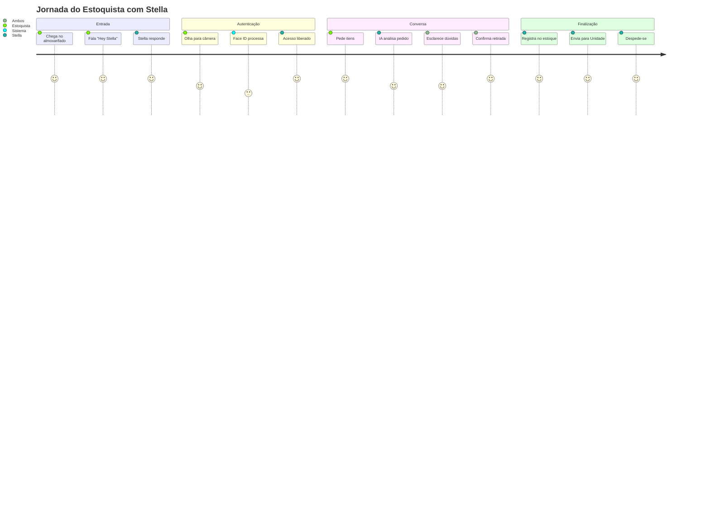
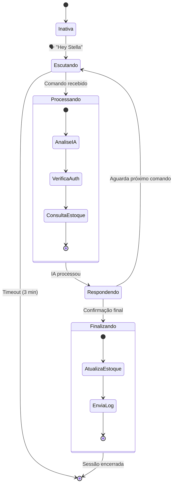

# 🤖 Stella Agent - Stellar - DASA Challenge

[](https://opensource.org/licenses/MIT)
[](https://www.python.org/downloads/)
[](https://github.com/psf/black)
[](CONTRIBUTING.md)

Assistente Inteligente para Gerenciamento de Almoxarifado com reconhecimento facial, comandos de voz e integração com sistemas de unidade.

**[📋 Documentação](#-visão-geral)** | **[🚀 Instalação](INSTALLATION_GUIDE.md)** | **[🤝 Contribuir](CONTRIBUTING.md)** | **[📡 API Docs](ASYNC_RESPONSES.md)**

## 📋 Visão Geral

A Stella Agent é um agente de IA construído para resolver o problema de vazão de estoque e aviso tardio de estoque em baixa, evidênciado pela DASA. Consiste em um assistente de retirada de produtos do estoque, de forma resumida, a Stella (de forma natural), conversa com o funcionário para saber exatamente o que e quantas unidades ele está retirando. Após confirmação (Quando ambas as partes não tem mais dúvidas), a Stella registra essa retirada e envia para o Sistema de Unidade do hospital, o qual tem todos os logs de retirada e controle de estoque. A Stella foi construída para agilizar o trabalho do estoquista sem que ele delegue a função de controlar o Estoque.

## 🔄 Fluxo da Stella

### Diagrama de Interação


```mermaid
sequenceDiagram
    participant E as 👤 Estoquista
    participant S as 🤖 Stella
    participant F as 📸 Face ID
    participant AI as 🧠 Processamento de IA
    participant DB as 📦 Estoque
    participant U as 🏥 Sistema Unidade

    Note over E,U: ⏳ Tempo médio de interação: 15 segundos
    
    E->>S: 🗣️ "Hey Stella"
    S->>E: 👋 "Olá! Como posso ajudar?"
    
    Note over S: 📱 Sessão iniciada
    
    E->>S: 🗣️ "Preciso de 5 seringas"
    S->>AI: 🔍 Processa comando
    AI->>DB: 📊 Consulta estoque
    
    alt 🔐 Autenticação necessária
        S->>E: 📸 "Por favor, olhe para a câmera"
        E->>F: 👁️ Reconhecimento facial
        F->>S: ✅ Usuário autenticado
    end
    
    AI->>S: 🎯 Análise: "Qual tipo? 10ml ou 5ml?"
    S->>E: 🤔 "Temos seringas de 10ml e 5ml. Qual você precisa?"
    
    E->>S: 🗣️ "10ml, por favor"
    S->>AI: 🔍 Confirma especificação
    AI->>DB: ⚠️ Verifica: estoque crítico/outliers
    
    alt ⚠️ Estoque baixo detectado
        S->>E: 🟡 "Restam apenas 8 unidades (estoque baixo)"
        E->>S: 🗣️ "Tudo bem, confirmo"
    end
    
    S->>E: ✅ "Registrei 5 seringas 10ml."
    S->>DB: 📝 Atualiza estoque (50→45)
    S->>U: 📤 Envia log de retirada
    
    Note over E,U: ✨ Interação completa!
```

###  Jornada de uma retirada


```mermaid
journey
    title Jornada do Estoquista com Stella
    section Entrada
      Chega no almoxarifado: 5: Estoquista
      Fala "Hey Stella": 5: Estoquista
      Stella responde: 5: Stella
    section Autenticação
      Olha para câmera: 4: Estoquista
      Face ID processa: 3: Sistema
      Acesso liberado: 5: Stella
    section Conversa
      Pede itens: 5: Estoquista
      IA analisa pedido: 4: Stella
      Esclarece dúvidas: 4: Ambos
      Confirma retirada: 5: Ambos
    section Finalização
      Registra no estoque: 5: Stella
      Envia para Unidade: 5: Stella
      Despede-se: 5: Stella
```


### Fluxo de Estado da Stella


```mermaid
stateDiagram-v2
    [*] --> Inativa
    Inativa --> Escutando : 🗣️ "Hey Stella"
    Escutando --> Processando : Comando recebido
    
    state Processando {
        [*] --> AnaliseIA
        AnaliseIA --> VerificaAuth
        VerificaAuth --> ConsultaEstoque
        ConsultaEstoque --> [*]
    }
    
    Processando --> Respondendo : IA processou
    Respondendo --> Escutando : Aguarda próximo comando
    Respondendo --> Finalizando : Confirmação final
    
    state Finalizando {
        [*] --> AtualizaEstoque
        AtualizaEstoque --> EnviaLog
        EnviaLog --> [*]
    }
    
    Finalizando --> [*] : Sessão encerrada
    Escutando --> [*] : Timeout (3 min)
```

## ⚡ Tempos de Resposta

| Ação | Tempo Esperado | Método |
|------|----------------|--------|
| 🗣️ **Comando de voz** | ~50ms | HTTP Response |
| 🧠 **Processamento IA** | ~2-4s | WebSocket Event |
| 📸 **Reconhecimento facial** | ~1-2s | WebSocket Event |
| 📝 **Registro no estoque** | ~100ms | Background |
| 📤 **Envio para Unidade** | ~200ms | Background |
| ⏱️ **Total da interação** | **< 15s** | **Objetivo** |

## 🏗️ Estrutura do Projeto

```
stella/
├── api/               # Fluxo e padronização de API
│   ├── __init__.py
│   ├── models/
│   ├── routes/
│   └── service/
├── agent/             # Processamento de voz e comandos
│   ├── __init__.py
│   └── speech_processor.py
├── face_id/           # Reconhecimento facial
│   ├── __init__.py
│   └── face_recognizer.py
├── data/              # Simples database com Json
│   ├── faces.json
│   └── stock.json
├── messaging/         # Comunicação com Sistema da Unidade
│   ├── __init__.py
│   └── unit_system_client.py
├── websocket/         # Comunicação com Front da Stella
│   ├── __init__.py
│   └── websocket_manager.py
├── config/            # Configurações e armazenamento
│   ├── __init__.py
│   ├── settings.py
│   └── stella_config.yaml
main.py                # Inicializar aplicação
```

## 🚀 Setup e Instalação

📚 **[Guia Completo de Instalação](INSTALLATION_GUIDE.md)**

### Quick Start

```bash
# Clone o repositório
git clone https://github.com/peguidotte/stella-agent.git
cd stella-agent

# Crie e ative o ambiente virtual
python -m venv venv
source venv/bin/activate  # No Windows: .\venv\Scripts\activate

# Instale as dependências
pip install -r requirements.txt

# Configure as variáveis de ambiente
cp .env.example .env
# Edite o .env com suas credenciais

# Inicie o servidor
python main.py
```

Acesse a documentação da API em: http://localhost:8000/docs

## 🧪 Testes

```bash
# Instalar dependências de desenvolvimento
pip install -r requirements-dev.txt

# Executar testes
pytest

# Com cobertura
pytest --cov=stella --cov-report=html
```

## 📚 Documentação

- **[Installation Guide](INSTALLATION_GUIDE.md)** - Guia detalhado de instalação
- **[Async Responses](ASYNC_RESPONSES.md)** - Documentação de eventos WebSocket
- **[Contributing](CONTRIBUTING.md)** - Guia para contribuidores
- **[Code of Conduct](CODE_OF_CONDUCT.md)** - Código de conduta
- **[Security](SECURITY.md)** - Política de segurança
- **[Changelog](CHANGELOG.md)** - Histórico de mudanças

## 🤝 Como Contribuir

Contribuições são bem-vindas! Por favor:

1. Leia o [CONTRIBUTING.md](CONTRIBUTING.md)
2. Fork o projeto
3. Crie sua feature branch (`git checkout -b feature/AmazingFeature`)
4. Commit suas mudanças (`git commit -m 'feat: add amazing feature'`)
5. Push para a branch (`git push origin feature/AmazingFeature`)
6. Abra um Pull Request

## 📝 Licença

Este projeto está licenciado sob a MIT License - veja o arquivo [LICENSE](LICENSE) para detalhes.

## 👥 Time Stellar

Este projeto é parte do **DASA Challenge - FIAP 2025**.

Desenvolvido com ❤️ pela equipe Stellar.

## 🔗 Links Úteis

- [Documentação da API](http://localhost:8000/docs)
- [ReDoc](http://localhost:8000/redoc)
- [Issues](https://github.com/peguidotte/stella-agent/issues)
- [Pull Requests](https://github.com/peguidotte/stella-agent/pulls)

---

**⭐ Se este projeto foi útil para você, considere dar uma estrela no GitHub!**